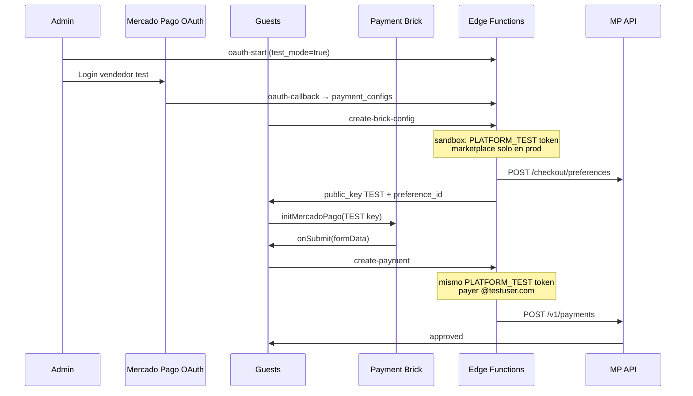

# Handoff: integración Mercado Pago (SplitMe)

Documento para replicar en otra rama/repo (p. ej. con Codex) los ajustes que resolvieron Brick vacío, error **2034** y flujo sandbox.

---

## 1. Contexto del producto

**Modelo (no cambiar sin consulta):** Marketplace SplitMe + **Payment Brick** (no Checkout Pro redirect, no cobro directo sin marketplace).

| Rol | Quién | Dónde vive |
|-----|--------|------------|
| **Integrador / marketplace** | App SplitMe en Developers MP | Secrets Supabase (`CLIENT_ID`, `CLIENT_SECRET`, public key) |
| **Vendedor (restaurante)** | OAuth desde admin | `payment_configs` (tokens cifrados) |
| **Comprador** | Comensal en guests | Brick + tarjetas de prueba |

Flujo:

1. Admin conecta restaurante vía OAuth (`mercadopago-oauth-start` → callback).
2. Guests llama `mercadopago-create-brick-config` → `public_key` + `preference_id`.
3. Frontend monta `<Payment />` (SDK React) con `initMercadoPago(publicKey)`.
4. `onSubmit` del Brick → `mercadopago-create-payment` → `POST /v1/payments`.
5. Webhook concilia por `external_reference` (`orderId|guestId` o `orderId|guestId|chargeId`).

---

## 2. Síntomas que vimos

| Síntoma | Causa real |
|---------|------------|
| Pantalla Brick **vacía** | `initMercadoPago()` no se llamaba (o sin `PUBLIC_KEY` válida) |
| Consola: `Expected the PUBLIC_KEY to render the MercadoPago SDK React` | Falta `initMercadoPago` con key de `brick-config` |
| `POST mercadopago-create-payment` → **400** | MP rechaza el pago; casi siempre **`mp_code: 2034`** |
| `MercadoPago has already been initialized` | Ruido: doble init del SDK (secundario) |
| Admin crasheaba en Medios de pago | Imports lucide borrados al limpiar UI legacy (`Key`, `User` usados en Transferencia) |
| Footer admin en v1.0.20 | Versión sale de `package.json` → `VITE_APP_VERSION`, no del commit message |

**Importante:** El Brick **no cambia de diseño** en sandbox. Modo prueba = credenciales **TEST-** + tarjetas de prueba, no URL `sandbox.mercadopago.com.ar` en este flujo.

---

## 3. Causa raíz (problemas encadenados)

### 3.1 Frontend — Brick no renderizaba

El SDK React **exige** `initMercadoPago(publicKey)` **antes** de `<Payment />`, con la public key del backend (TEST en dev).

**Fix:** Llamar `ensureMpInit(pk)` tras `mercadopago-create-brick-config`, usando `data.public_key`.

### 3.2 Confusión de entornos TEST vs APP_USR

MP exige que todos los actores sean del mismo entorno. Mezclar public key **TEST-** con token **APP_USR**, o `marketplace: MP-MKT-{client_id}` (app prod) con tokens **TEST-** → **2034** o fallos de preferencia.

**Fix:** Diagnóstico en `brick-config` (`seller_token_prefix`, `platform_public_key_prefix`, `env_mismatch`, `oauth_test_mode`) + banner de mismatch en UI.

### 3.3 Marketplace en sandbox (causa principal del 2034)

Con vendedor test del panel (OAuth `test_mode: true`):

1. OAuth guarda token **TEST-** del vendedor.
2. La preferencia llevaba `marketplace: MP-MKT-{CLIENT_ID}` con `CLIENT_ID` productivo.
3. MP rechaza la combinación → **2034** al pagar (a veces al resolver preferencia en el Brick).

**Fixes (commits `7110fbb`, `d636c9f`, `0d9612a`):**

```typescript
// mercadopago-create-brick-config
if (marketplaceId && checkoutEnv === "production") {
  preferenceBody.marketplace = marketplaceId; // NO en sandbox
}

// brick-config Y create-payment — mismo token en ambos pasos
if (checkoutEnv === "sandbox") {
  const platformTestToken = Deno.env.get("MERCADOPAGO_PLATFORM_TEST_ACCESS_TOKEN")?.trim();
  if (platformTestToken) {
    accessToken = platformTestToken;
    tokenSource = "platform_test_token";
  }
}
```

**Regla:** En sandbox, preferencia **y** pago usan el **mismo** access token TEST de la **plataforma**. En **producción**, token OAuth del restaurante + `marketplace` en preferencia.

### 3.4 `application_fee` en `/v1/payments`

Con Brick + marketplace y fee 0, no enviar `application_fee` en el POST. La comisión va en la preferencia (`marketplace_fee: 0`).

**Fix:** Quitar `application_fee` de `mercadopago-create-payment`.

### 3.5 Email del pagador en sandbox (2198)

En test, MP puede exigir email **`@testuser.com`** (error **2198**).

**Fix:** En backend, si sandbox:

```typescript
resolveMarketplacePayerEmail(guestId, brickEmail, { sandbox: true });
// → guest{n}@testuser.com si el Brick no envía @testuser.com
```

También `binary_mode: true` en preferencia/pago cuando `oauth_test_mode`.

### 3.6 Enfoques que NO funcionaron

- Emails de “comprador test” del panel — las cuentas test **no tienen email** (solo User ID + TESTUSER + contraseña).
- `MERCADOPAGO_SANDBOX_BUYER_EMAIL` como workaround principal.
- Credenciales manuales en admin (legacy) — eliminado; solo OAuth.
- Cuenta test tipo **Marketplace** para conectar restaurante — el marketplace es la **app SplitMe**; para el local usar **Vendedor (Seller)**.

### 3.7 Admin (`splitme-admin`)

- UI legacy (pegar tokens, checkbox sandbox oculto) confundía.
- **Fix:** Solo OAuth + checkbox **Modo prueba (sandbox)** → `test_mode: true` en `mercadopago-oauth-start`.
- No borrar imports `Key`, `User` (Transferencia).

---

## 4. Archivos clave (splitme-guests)

| Archivo | Comportamiento |
|---------|----------------|
| `mercadopago-oauth-start` | PKCE + `test_mode` desde admin |
| `mercadopago-oauth-callback` | `oauth_test_mode`, tokens cifrados |
| `_shared/mp-oauth.ts` | `resolveSellerAccessToken()` |
| `mercadopago-create-brick-config` | Preferencia; sandbox → token plataforma; `marketplace` solo production |
| `mercadopago-create-payment` | Mismo token que brick-config en sandbox; payer `@testuser.com`; sin `application_fee` |
| `_shared/mp-errors.ts` | `getMpMarketplaceId()`, 2034/2198, `resolveMarketplacePayerEmail` |
| `components/MercadoPagoPaymentBrick.tsx` | `initMercadoPago`, banner sandbox, panel tarjetas test |
| `lib/mercadopago-errors.ts` | Mensajes usuario + mismatch TEST/APP_USR |

Admin: `splitme-admin/pages/SettingsPage.tsx` — OAuth + `mpConnectTestMode`.

---

## 5. Secrets Supabase

```bash
MERCADOPAGO_CLIENT_ID=...
MERCADOPAGO_CLIENT_SECRET=...
MERCADOPAGO_OAUTH_REDIRECT_URI=https://<project>.supabase.co/functions/v1/mercadopago-oauth-callback
MERCADOPAGO_OAUTH_STATE_SECRET=...
MERCADOPAGO_PLATFORM_PUBLIC_KEY=TEST-...              # Public key TEST de la app (dev)
MERCADOPAGO_PLATFORM_TEST_ACCESS_TOKEN=TEST-...       # Access token TEST app — crítico sandbox
MERCADOPAGO_TOKEN_ENCRYPTION_KEY=...                  # AES-GCM 32 bytes base64
MERCADOPAGO_WEBHOOK_SECRET=...
```

Vercel guests (opcional): `VITE_MERCADOPAGO_PLATFORM_PUBLIC_KEY` — fallback; preferir `brick-config`.

---

## 6. Checklist sandbox

1. Admin → **Modo prueba** ON → Conectar → login **Vendedor test** (Seller, no Marketplace).
2. `mercadopago-create-brick-config`: `checkout_env: "sandbox"`, `token_source: "platform_test_token"`, prefijos **TEST**.
3. Brick visible.
4. Tarjeta `5031 7557 3453 0604`, titular **APRO**, CVV `123`.
5. `mercadopago-create-payment` → 200, `status: "approved"`.

Si falla: leer **`mp_code`** y **`mp_causes`** en Network.

---

## 7. Producción (cuenta real del restaurante)

1. Admin → **Modo prueba** OFF → OAuth cuenta real.
2. `MERCADOPAGO_PLATFORM_PUBLIC_KEY` = **APP_USR-…**
3. Preferencia con `marketplace: MP-MKT-{CLIENT_ID}`.
4. Pago con token OAuth del **vendedor** (no `PLATFORM_TEST_ACCESS_TOKEN`).
5. Reevaluar `marketplace: true` en `initialization` del Brick según doc MP (en sandbox se quitó por 2034).

---

## 8. Commits de referencia

**splitme-guests:** `7110fbb`, `d636c9f`, `0d9612a`, `a5dd1ed`, `bb19a32`, fixes históricos `initMercadoPago` y `application_fee`.

**splitme-admin:** `ace2d41` (OAuth test), `9df947d`/`3a6e3c6` (imports), `75c40b5` (PKCE + cifrado).

---

## 9. Checklist Codex

1. No formulario manual de credenciales MP en admin.
2. No `marketplace: MP-MKT-...` en preferencias si `checkoutEnv === "sandbox"`.
3. Sí `MERCADOPAGO_PLATFORM_TEST_ACCESS_TOKEN` en brick-config **y** create-payment (mismo token).
4. Sí `initMercadoPago(publicKey)` antes del Brick.
5. Sí email `@testuser.com` en backend en sandbox.
6. Sí diagnóstico en `brick-config` y logs en `create-payment`.
7. Mantener OAuth vendedor en DB (producción + trazabilidad).
8. No borrar imports lucide usados fuera de la sección MP en Settings.

---

## 10. Diagrama



---

Ver también: [MERCADOPAGO.md](./MERCADOPAGO.md)
